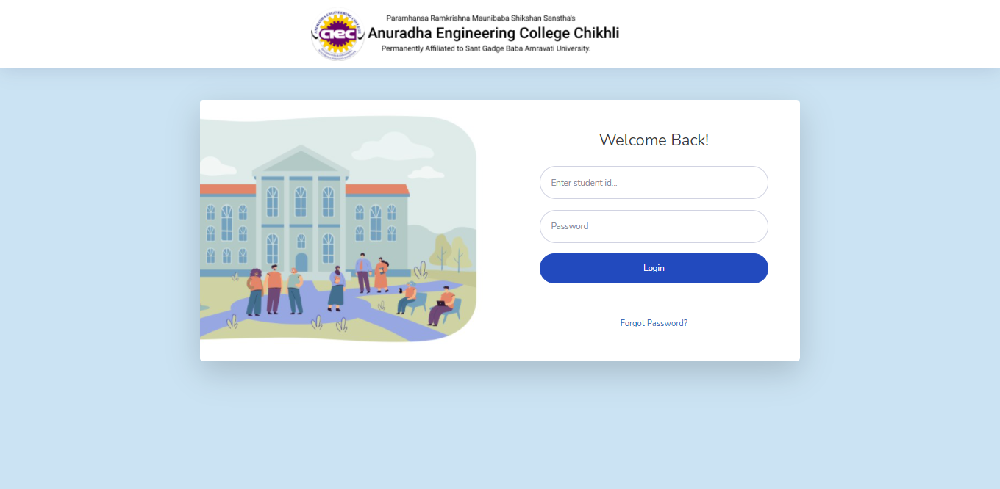
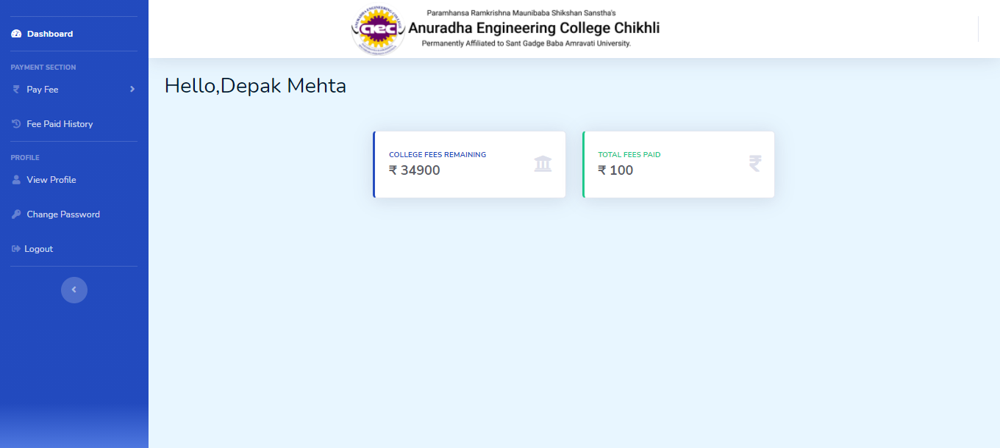
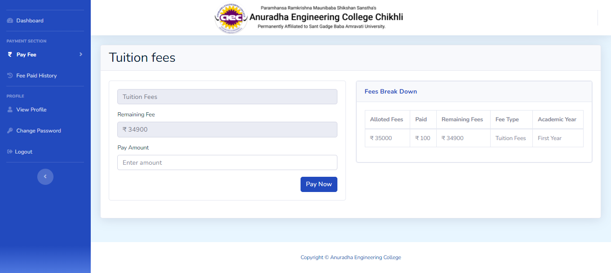
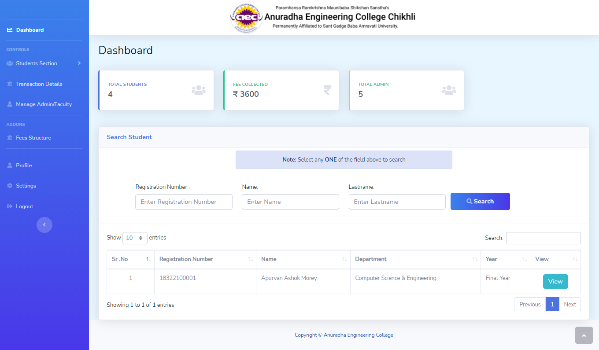
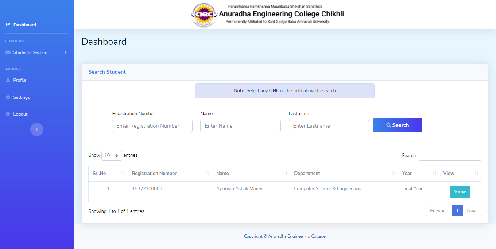

# AEC Pay: An Online Payment Portal.

AEC Pay is a Web Application for **Anuradha Engineering College**, its main use is for students to pay college fees online without waiting in the long queue for hours. Students can pay their college fees from anywhere and at any time. This web application enables the students to get their receipt generated at an instance of a time when they pay their fees and receives a confirmation message. The transaction details will be reflected in the user account. 

## Some Screenshots of this Web Application.

### - Login Page

### - Student Dashboard

### - Student Fees Pay Page

### - Admin Dashboard

### - Staff Dashboard

### - Add Student

